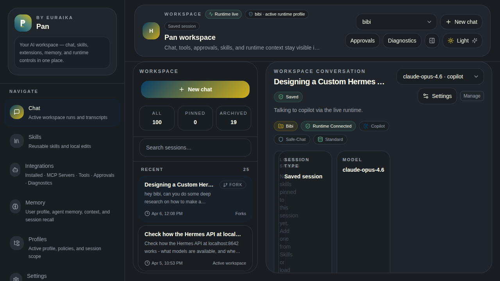
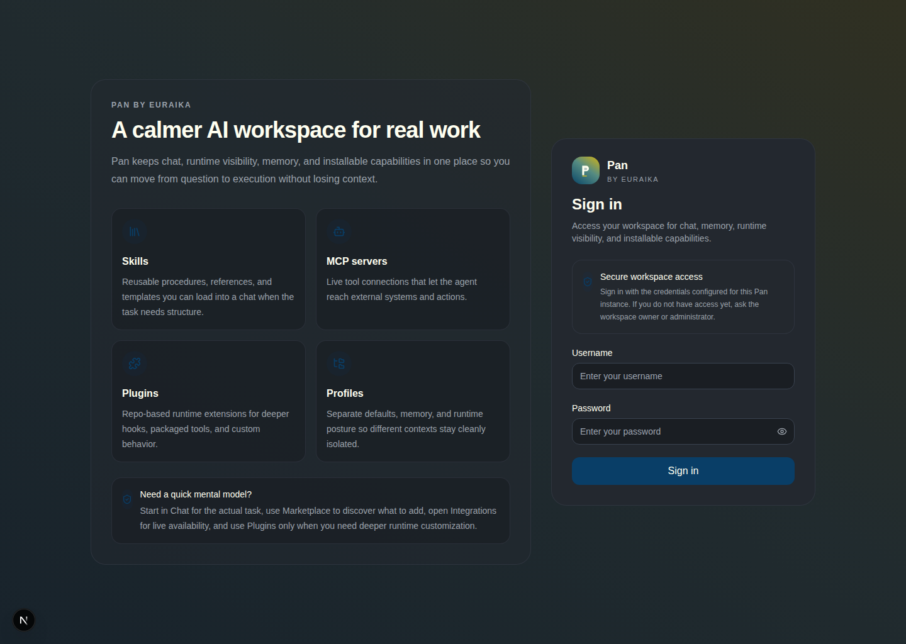
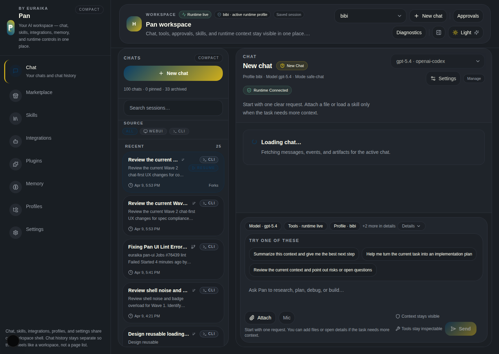
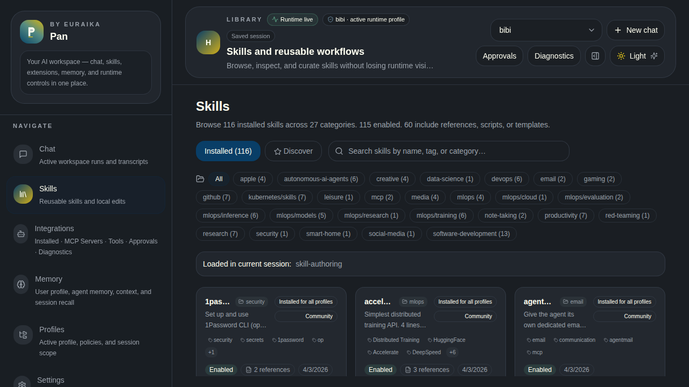
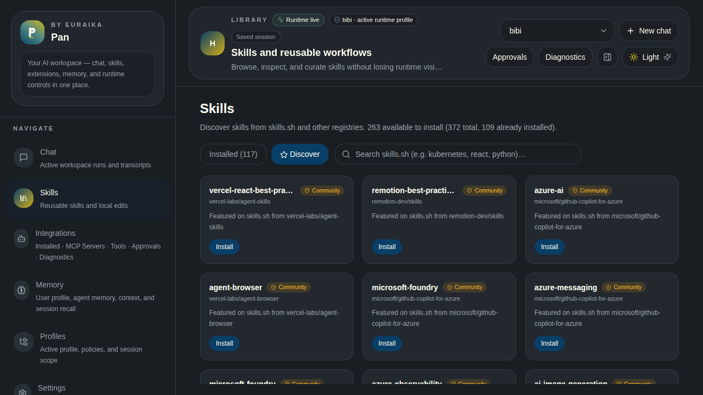
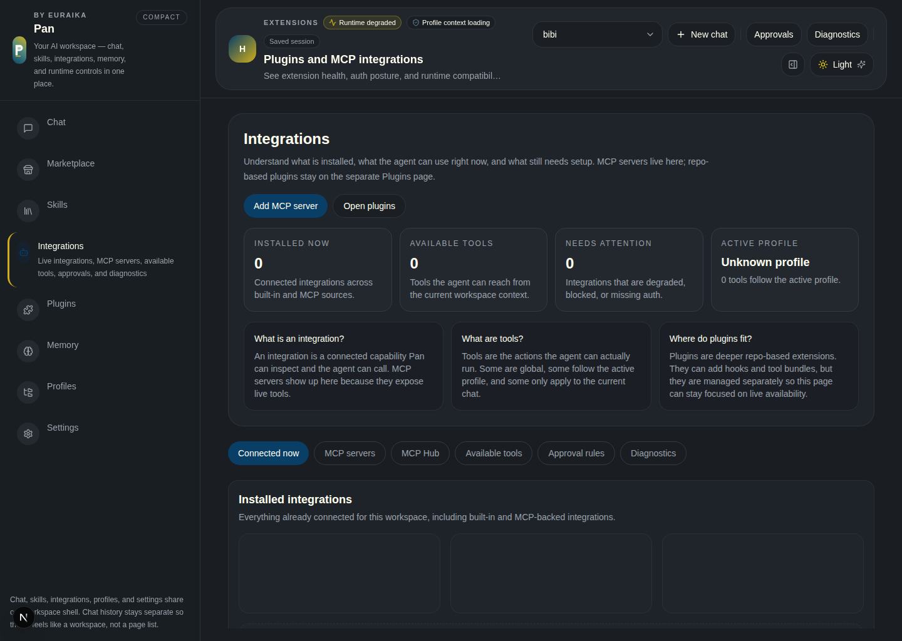
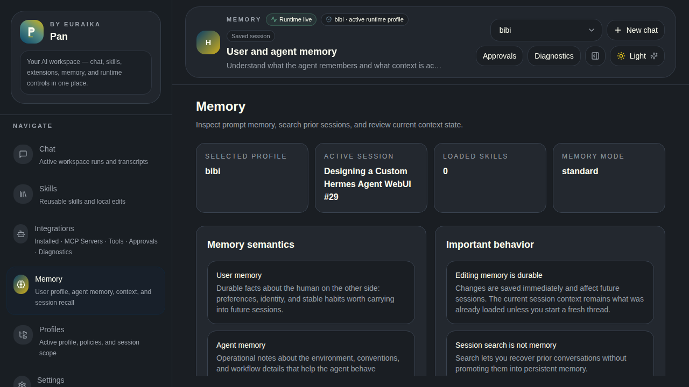
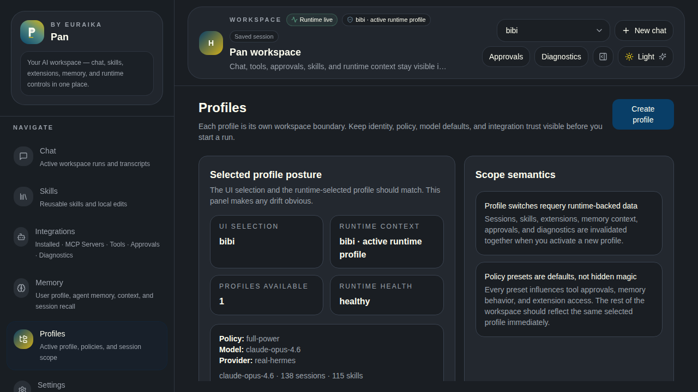
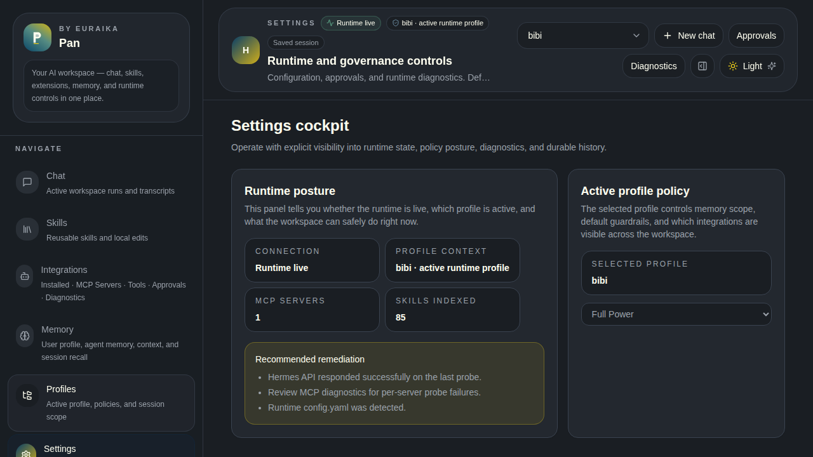

<p align="center">
  
</p>

<h1 align="center">Pan by Euraika</h1>

<p align="center">
  <strong>Beautiful WebUI for <a href="https://github.com/NousResearch/hermes-agent">Hermes Agent</a></strong>
</p>

<p align="center">
  <a href="https://github.com/Euraika-Labs/pan-ui/actions/workflows/ci.yml"></a>
  <a href="https://github.com/Euraika-Labs/pan-ui/actions/workflows/codeql.yml"></a>
  <a href="https://www.npmjs.com/package/@euraika-labs/pan-ui"></a>
  <a href="https://github.com/Euraika-Labs/pan-ui/releases"></a>
  <a href="./LICENSE"></a>
</p>

<p align="center">
  <a href="#quick-start">Quick Start</a> •
  <a href="#features">Features</a> •
  <a href="#screenshots">Screenshots</a> •
  <a href="#architecture">Architecture</a> •
  <a href="#configuration">Configuration</a> •
  <a href="CHANGELOG.md">Changelog</a> •
  <a href="CONTRIBUTING.md">Contributing</a>
</p>

---

Pan is a self-hosted web interface for [Hermes Agent](https://github.com/NousResearch/hermes-agent) — the open-source AI agent by Nous Research. Chat with your agent, manage skills from the [skills.sh](https://skills.sh) marketplace, control extensions and MCP integrations, inspect memory, and operate profiles — all from a single dashboard with live runtime awareness.



## Quick Start

### Install and run (one command)

```bash
npx @euraika-labs/pan-ui
```

The setup wizard runs on first launch to configure your Hermes connection. After setup, Pan starts on [localhost:3199](http://localhost:3199).

### Run as a background service

```bash
# Quick daemon — fork to background
npx @euraika-labs/pan-ui --daemon

# Check status, view logs, stop
npx pan-ui status
npx pan-ui logs
npx pan-ui stop
```

### Install as a system service (Linux)

```bash
# Installs a systemd user service — starts on login, survives logout
npx @euraika-labs/pan-ui service install

# Manage with standard systemctl commands
systemctl --user status pan-ui
systemctl --user restart pan-ui
journalctl --user -u pan-ui -f

# Remove when done
npx pan-ui service remove
```

### From source

```bash
git clone https://github.com/Euraika-Labs/pan-ui.git
cd pan-ui
npm install
npm run dev
```

Open [localhost:3199](http://localhost:3199). Default credentials: `admin` / `changeme`.

## Features

Pan is not a generic chat wrapper. It exposes the full operational surface of a running Hermes Agent instance:

| Feature | Description |
|---------|-------------|
| **Chat with streaming** | SSE-based streaming connected to a real Hermes runtime, with tool timelines, approval cards, and artifact rendering |
| **Skills marketplace** | Browse 112+ installed skills across 27 categories, discover and install 268+ more from [skills.sh](https://skills.sh) |
| **MCP integrations** | View installed MCP servers, their tools, health status, and diagnostics |
| **Persistent memory** | Inspect and edit global and profile-scoped user/agent memory |
| **Profile isolation** | Each profile is a full workspace boundary — sessions, skills, memory, API keys, and policy presets |
| **Runtime operations** | Approvals, run history, audit trails, telemetry, health monitoring, and JSON/CSV exports |
| **Daemon mode** | Run as a background process with PID management and log tailing |
| **Systemd integration** | Install as a persistent Linux user service with auto-start |

## Screenshots

<details>
<summary><strong>Login</strong></summary>


</details>

<details open>
<summary><strong>Chat</strong></summary>

Streaming chat connected to a live Hermes runtime. Session sidebar with search, pinning, and archiving. Tool timelines expand inline. Composer shows active model, mode, tools, and profile.



</details>

<details>
<summary><strong>Skills — Installed</strong></summary>

112 installed skills across 27 categories. Search by name, tag, or category. Each card shows source, tags, linked files count, and whether it's loaded in the current session.


</details>

<details>
<summary><strong>Skills — Discover</strong></summary>

Browse and install skills from the skills.sh hub. Trust badges (Trusted / Official / Community), install counts, and direct links to repos.


</details>

<details>
<summary><strong>Extensions & MCP</strong></summary>

Installed MCP servers with tool inventories, health badges, and capability toggles.


</details>

<details>
<summary><strong>Memory</strong></summary>

Global memory (shared across profiles) displayed as read-only cards. Profile-scoped memory is editable.


</details>

<details>
<summary><strong>Profiles</strong></summary>

Profile-based workspace isolation. Each profile scopes sessions, skills, memory, extensions, and API keys.


</details>

<details>
<summary><strong>Settings</strong></summary>

Runtime status, health monitoring, model selection, run history, audit browser, telemetry, approvals, and MCP diagnostics.


</details>

## Configuration

### CLI Options

```
npx pan-ui                     Start in foreground (interactive)
npx pan-ui --daemon | -d       Start in background
npx pan-ui stop                Stop the background daemon
npx pan-ui status              Check if Pan is running
npx pan-ui logs                Tail daemon log output
npx pan-ui setup               Re-run the setup wizard
npx pan-ui service install     Install systemd user service
npx pan-ui service remove      Remove systemd service
npx pan-ui --port 8080         Override the port
npx pan-ui --help              Show all options
```

### Environment Variables

Create a `.env.local` file or use the setup wizard (`npx pan-ui setup`):

| Variable | Default | Description |
|----------|---------|-------------|
| `HERMES_HOME` | `~/.hermes` | Hermes home directory |
| `HERMES_API_BASE_URL` | `http://127.0.0.1:8642` | Hermes API endpoint |
| `HERMES_API_KEY` | — | API key for Hermes (if configured) |
| `HERMES_WORKSPACE_USERNAME` | `admin` | Login username |
| `HERMES_WORKSPACE_PASSWORD` | `changeme` | Login password |
| `HERMES_WORKSPACE_SECRET` | *(auto-generated)* | Cookie signing secret |
| `HERMES_MOCK_MODE` | `false` | Use mock data when runtime is unavailable |
| `PORT` | `3199` | Server port |

## Architecture

```
┌─────────────────────────────────────────────────┐
│                    Browser                       │
│  Next.js App Router + TanStack Query + Tailwind  │
└───────────────────────┬─────────────────────────┘
                        │ fetch / SSE
┌───────────────────────▼─────────────────────────┐
│              Next.js API Routes                  │
│  /api/chat/stream    /api/skills    /api/memory  │
│  /api/profiles       /api/extensions /api/runtime│
└──────┬────────────────┬─────────────────────────┘
       │                │
       ▼                ▼
┌──────────────┐  ┌──────────────────────────────┐
│ Hermes API   │  │ Hermes Filesystem            │
│ :8642        │  │ ~/.hermes/                   │
│ OpenAI-compat│  │  ├─ profiles/                │
│ SSE streaming│  │  ├─ skills/                  │
└──────────────┘  │  ├─ memories/                │
                  │  └─ state.db                 │
                  └──────────────────────────────┘
```

### Tech Stack

| Layer | Technology |
|-------|------------|
| Framework | [Next.js 15](https://nextjs.org/) (App Router, standalone output) |
| Language | TypeScript |
| State | [TanStack Query](https://tanstack.com/query) v5 |
| Styling | [Tailwind CSS](https://tailwindcss.com/) 4 |
| Testing | [Vitest](https://vitest.dev/) + [Playwright](https://playwright.dev/) |
| Runtime | Node.js 18+ |

### Project Structure

```
src/
├── app/                  # Next.js routes and API endpoints
│   ├── api/              # Server-side API routes
│   │   ├── chat/         # Chat stream, sessions
│   │   ├── skills/       # Skills CRUD, hub, categories
│   │   ├── memory/       # User/agent memory, context inspector
│   │   ├── profiles/     # Profile CRUD
│   │   ├── extensions/   # MCP extensions
│   │   └── runtime/      # Health, approvals, runs, export
│   └── [page]/           # Client page routes
├── features/             # UI feature modules
│   ├── chat/             # Chat screen, composer, transcript
│   ├── skills/           # Skills browser, detail, hub cards
│   ├── memory/           # Memory editor
│   ├── extensions/       # Extension cards, tool inventory
│   ├── profiles/         # Profile management
│   ├── sessions/         # Session sidebar
│   └── settings/         # Runtime, health, audit, approvals
├── server/               # Hermes filesystem bridge
├── components/           # Shared layout and UI components
├── lib/                  # Types, schemas, stores, utilities
└── styles/               # Global CSS and theme tokens
bin/
└── pan-ui.mjs            # CLI launcher, setup wizard, daemon
tests/
├── unit/                 # Vitest unit tests
└── e2e/                  # Playwright end-to-end tests
```

## Development

```bash
npm run dev           # Start dev server (hot reload)
npm run lint          # ESLint
npm run test          # Vitest unit tests
npm run build         # Production build
npm run test:e2e      # Playwright e2e (requires dev server running)
```

## Security

- CLI commands use an allowlist guard before `execFileSync` — no arbitrary command injection
- Profile isolation ensures each workspace boundary has its own sessions, memory, and API keys
- CodeQL scanning runs on every push and PR
- File path parameters are sanitized to prevent directory traversal
- Login is cookie-based with `httpOnly` secure cookies
- See [SECURITY.md](SECURITY.md) for reporting vulnerabilities

## License

[MIT](LICENSE) © [Euraika Labs](https://github.com/Euraika-Labs)
